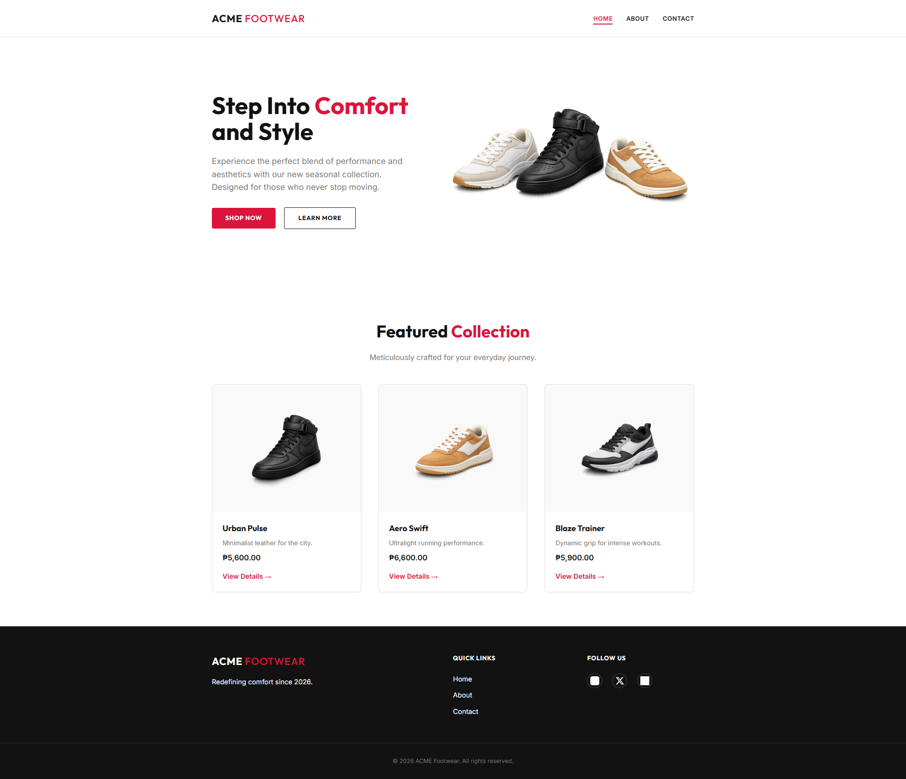
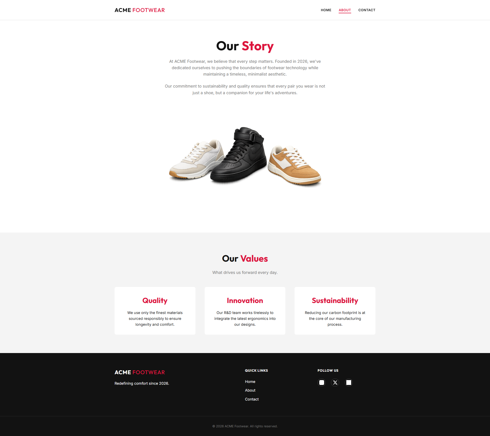
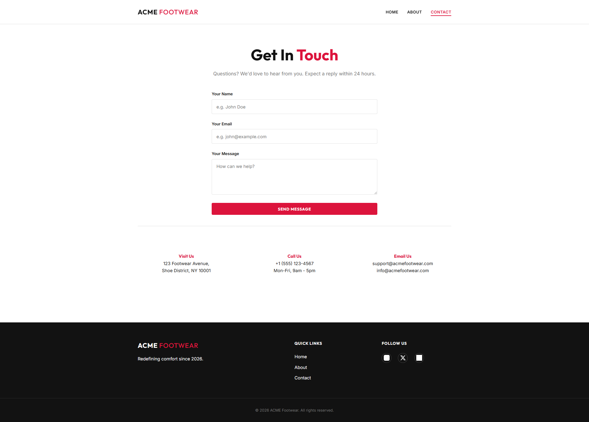
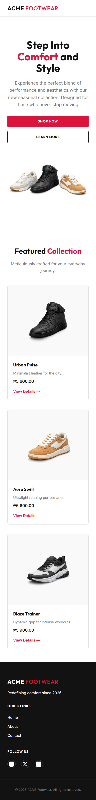
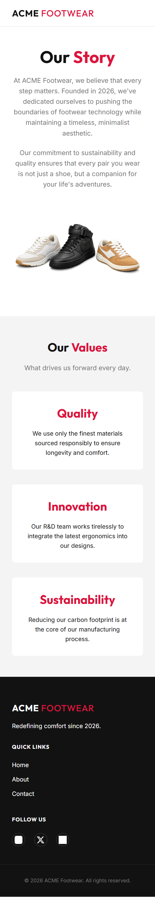
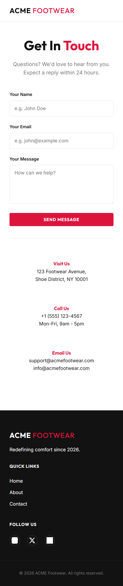

# ACME Footwear - Professional Retail Landing Page Challenge

## Build a Premium, Multi-Page Site with Vanilla Web Technologies

Welcome to the **ACME Footwear** project! This repository contains a complete, landing page built using **100% Vanilla HTML5 and CSS3**. This challenge is designed for students, trainees, and developers who want to master "The Hard Way" before moving to frameworks like React or Tailwind.

---

## Your Mission: The Replication Challenge

Your goal is to recreate this responsive, three-page retail site (`index.html`, `about.html`, `contact.html`) with **pixel-perfect accuracy**. You must adhere to the provided design system, use modern layout techniques (Grid/Flex), and maintain a professional Git history.

### 💡 Why Replication Matters (The Real World)

In professional software development, you don't usually "invent" designs as you code. Instead:

- **UI/UX Designers** provide high-fidelity mockups (using tools like Figma, Adobe XD, or Sketch).
- **Your Job** as a developer is to translate those designs into code with 100% fidelity.
- **Brand Consistency**: Small changes in spacing, color, or font can break a brand's identity.
- **Efficiency**: A developer who can accurately replicate a design saves the team time by reducing the "review and fix" cycles between design and engineering.

*Mastering the art of replication is the difference between a hobbyist and a professional engineer.*

---

## 📸 Visual Reference Guides

These screenshots are your **target design**. Your goal is to replicate these layouts exactly as shown in both Desktop and Mobile viewports.

### 🏙️ Desktop Mode (1920x1080)





---

### 📱 Mobile Mode (375x812)

|  |  |  |
| :---: | :---: | :---: |
| **Home Page** | **About Page** | **Contact Page** |

---

## 🏁 Getting Started: Cloning the Repository

Before you begin, you need to get a local copy of this project on your computer. This process is called **Cloning**.

### 💡 What is Cloning?

Think of cloning as "downloading a professional copy" of a project. Unlike a regular download, a cloned repository stays connected to its source on GitHub, allowing you to track changes, see the history, and eventually push your own work back to the cloud.

1. Open your terminal (Command Prompt, PowerShell, or Terminal).
2. Navigate to the folder where you want to store your projects.
3. Open cmd or terminal and Run the following command:

   ```bash
   git clone https://github.com/enehry/acme-footwear
   ```

4. Enter the new folder:

   ```bash
   cd acme-footwear
   ```

5. Open the folder in your code editor.

---

## 🛠️ Step-by-Step Creation Guide

Follow these phases exactly to ensure your project remains clean and organized. **You must commit after each phase.**

### Phase 1: Explore the Starter Kit

Once you have cloned the repository, your project folder will already be set up with the base structure.

1. **Navigate** into your project: `cd acme-footwear`.
2. **Verify** the following pre-provided folders are present:
    - `assets/images/` (Hero and Product images)
    - `assets/logos/` (Social media icons)
    - `assets/screenshots/` (Visual Reference Guides)
3. **Check Git Status**: Run `git status` to ensure you are on the `main` branch.

---

### Phase 2: Building the Foundation (The Missing Files)

1. Create the following empty files in your root directory:
   - `index.html`
   - `about.html`
   - `contact.html`
2. Create your stylesheet: `assets/css/style.css`.
3. Inside `style.css`, define your **Design Tokens**:
   - Palette: **Crimson Red** (`#DC143C`) as your primary accent.
   - Typography: Import 'Outfit' (Headings) and 'Inter' (Body) from Google Fonts.
   - Resets: Use a modern CSS reset (box-sizing, margin/padding: 0).
4. Set up your **CSS Variables** (`:root`) for consistent colors and spacing.

> [!TIP]
> **🚀 Git Action: Phase 2 Complete**
>
> ```bash
> git add .
> git commit -m "create core HTML files and initialize design system in style.css"
> ```

---

### Phase 3: The Common Shell (Header & Footer)

1. Write the semantic HTML for your `<header>` and `<footer>`.
2. Implement a responsive navigation bar using **Flexbox**.
3. Create the social media icon set in the footer using the provided brand logos (`Instagram_icon.png`, `x_logo.png`, `fb_logo.png`).

> [!TIP]
> **🚀 Git Action: Phase 3 Complete**
>
> ```bash
> git add .
> git commit -m "add global header and footer with social media icons"
> ```

---

### Phase 4: Home Page - Hero & Interactive Content

1. Build the Hero section (`#hero`) with a clear Value Proposition.
2. Add the primary CTA (Call to Action) buttons.
3. Use a subtle `fade-in` CSS animation on load.

> [!TIP]
> **🚀 Git Action: Phase 4 Complete**
>
> ```bash
> git add index.html
> git commit -m "implement hero section with crimson red branding and animations"
> ```

---

### Phase 5: Home Page - The Grid (Product Collection)

1. Create a "Featured Collection" section.
2. Use **CSS Grid** to create a responsive 3-column layout for product cards.
3. Implement hover effects on product images for a premium feel.

> [!TIP]
> **🚀 Git Action: Phase 5 Complete**
>
> ```bash
> git add .
> git commit -m "implement responsive product grid using CSS Grid"
> ```

---

### Phase 6: Content Pages (About & Contact)

1. Create `about.html` and `contact.html`.
2. Ensure they share the exact same Header and Footer as `index.html`.
3. In `about.html`, use a two-column Flexbox layout for company history.
4. In `contact.html`, build an accessible form with proper labels and inputs.

> [!TIP]
> **🚀 Git Action: Phase 6 Complete**
>
> ```bash
> git add about.html contact.html
> git commit -m "complete About story and Contact form pages"
> ```

---

### Phase 7: Mobile Mastery (Responsive Design)

1. Add media queries for screens below `768px`.
2. Adjust the product grid to 1-column on mobile.
3. Optimize navigation for touch-friendly targets.
4. Scale typography for better readability on small screens.

> [!TIP]
> **🚀 Git Action: Phase 7 Complete**
>
> ```bash
> git add .
> git commit -m "finalize mobile-first responsive adjustments"
> ```

---

## 📂 Final Folder Structure

When complete, your repository should look like this:

```text
acme-footwear/
├── index.html              # Home Page
├── about.html              # Company Story
├── contact.html            # Contact Form & Details
├── assets/
│   ├── css/
│   │   └── style.css        # Central Stylesheet
│   ├── images/
│   │   ├── hero.png         # Main branding image
│   │   └── shoe_1, 2, 3.png # Products
│   ├── logos/
│   │   ├── fb_logo, x_logo, Instagram_icon.png
│   └── screenshots/          # Student Reference Previews
│           desktop_home.png, mobile_home.png...
```

## 📋 Technical Implementation Notes

- **Semantic HTML Only**: Use appropriate tags avoid using `div` for main layout elements.
- **No JS Required**: All tooltips, hovers, and transitions must be CSS-powered.
- **Accessibility**: Ensure form fields have corresponding `label` tags.

---

## 🚀 How to Submit

Once you have completed the challenge:

1. **Upload** your project to a public repository on **GitHub**.
2. **Share** the repository link with **[enehry@gmail.com](mailto:enehry@gmail.com)** for review and feedback.

*Developed for the Module 2: Advance HTML & CSS Fundamentals*

**Prepared by**: [Nehry Dedoro](https://nehrydedoro.com)
